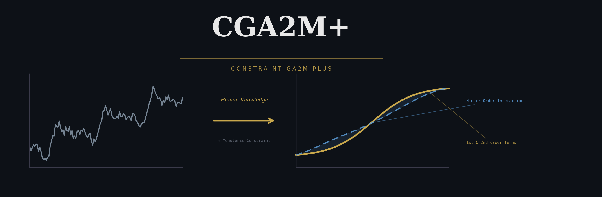

# CGA2M+ (Constraint GA2M plus)

[English](README.md) | 日本語

CGA2M+（Constraint GA2M plus）は、GA2MをベースにGA2Mの**解釈性**と**精度**の両面を改善したモデルです。詳細は論文をご参照ください。GA2Mとの主な違いは以下の2点です：

1. 単調性制約の導入
2. モデルの解釈性を維持しながら高次交互作用を導入

# 背景

機械学習モデルには**精度と解釈性のトレードオフ**が存在します：

| モデル | 精度 | 解釈性 |
|---|---|---|
| ニューラルネット、GBDT | 高い | 低い |
| 線形回帰、GAM | 低い | 高い |
| **CGA2M+** | **高い** | **高い** |

GA2Mはその中間を狙ったモデルですが、以下の2つの問題がありました：

| 問題 | 内容 |
|---|---|
| ① 非単調性 | ドメイン知識に反する形状関数が学習されうる（例：部屋数が増えると家賃が下がる） |
| ② 高次交互作用の欠如 | 2変数の交互作用項までしか扱えず、高次の交互作用を捉えられない |

CGA2M+はこれら両方の問題を解決します。

# モデル

### GA2M

$$y = \sum_{i \in Z^1} f_i(x_i) + \sum_{(i,j) \in Z^2} f_{ij}(x_i, x_j)$$

- $f_i(x_i)$：各特徴量の主効果（shape function）
- $f_{ij}(x_i, x_j)$：2変数の交互作用項
- shape functionにはLightGBMを使用

### CGA2M+

GA2Mに**単調性制約**と**高次項**を追加したモデル：

$$y = \sum_{i \in Z_c} f_i(x_i) + \sum_{i \in Z_u} f_i(x_i) + \sum_{(i,j) \in Z_{cc}} f_{ij}(x_i, x_j) + \sum_{(i,j) \in Z_{cu}} f_{ij}(x_i, x_j) + \sum_{(i,j) \in Z_{uu}} f_{ij}(x_i, x_j) + f_\text{high}(x_1, x_2, \ldots, x_K)$$

| 記号 | 意味 |
|---|---|
| $Z_c$ | 単調性制約を課す特徴量のインデックス集合 |
| $Z_u$ | 単調性制約を課さない特徴量のインデックス集合 |
| $Z_{cc}, Z_{cu}, Z_{uu}$ | 特徴量ペアの組み合わせ |
| $f_\text{high}$ | 高次交互作用を捉える項（単体では解釈不可だが精度向上に寄与） |

# CGA2M+の詳細

shape functionにLightGBMを使用します。

- **1. 単調性制約の導入**

単調性を取り入れることで、モデルの解釈性を高めることができます。例えば、「不動産市場において、部屋数が増えると価格が下がる」といった状況が生じないようにできます。どの特徴量に単調性を持たせるかはドメイン知識に基づいて決定します。単調性制約のアルゴリズムはLightGBMに実装されており、木の分岐を制限する形で機能します。詳細はLightGBMのドキュメントをご参照ください。


- **2. 解釈性を維持した高次交互作用の導入**

GA2Mは高次の交互作用を捉えることが困難です。この問題に対処するため、1次・2次項の残差を学習する $f_\text{high}$ を導入します。これにより、予測の大部分は引き続き解釈可能な1次・2次項で説明され、説明されない残差部分を高次項が予測する構造になります。

$f_\text{high}$ はすべての解釈可能な項が固定された後に学習されるため、それらの形状には影響を与えず、モデル全体の解釈性が保たれます。

# 特徴量重要度とPruning

各shape functionの「重要度」を以下で定義し、閾値以下のものをモデルから削除（Prune）します：

$$\text{importance of } f_i = \frac{\text{effect}_i}{\text{effect}_\text{all}}$$

$$\text{effect}_i = \frac{\sum_{n=1}^{N} |f_i(x_{in}) - \bar{f}_i|}{\sum_{n=1}^{N} |y_n - \bar{y}|}$$

$$\text{effect}_\text{all} = \sum_i \text{effect}_i + \sum_{ij} \text{effect}_{ij} + \text{effect}_\text{high}$$

- $\bar{f}_i$：$f_i$ の訓練データ平均
- $\bar{y}$：目的変数の訓練データ平均

$f_\text{high}$ の重要度が小さいということは、モデル全体が解釈可能な1次・2次項で説明できていることを意味します。

# 学習アルゴリズム


1. バックフィッティングで $f_i$、$f_{ij}$ を順次学習
2. 重要度が閾値以下の shape function を削除（Prune）
3. 残った特徴量で再学習（Retrain）
4. 残差 $y - F$ を高次項 $f_\text{high}$ で学習

詳細は論文をご参照ください。

# インストール
PyPIからインストールできます。PyPIのプロジェクトページは[こちら](https://pypi.org/project/cga2m-plus/)。
```bash
pip install cga2m-plus
```

# 使い方
詳細は `examples/How_to_use_CGA2M+.ipynb` をご参照ください。
GitHubで表示されない場合は[こちら](https://kokes.github.io/nbviewer.js/viewer.html#aHR0cHM6Ly9naXRodWIuY29tL01LLXRlY2gyMC9DR0EyTV9wbHVzL2Jsb2IvbWFpbi9leGFtcGxlcy9Ib3dfdG9fdXNlX0NHQTJNJTJCLmlweW5i)をクリックしてください。

## 学習

```python
cga2m = Constraint_GA2M(X_train,
                        y_train,
                        X_eval,
                        y_eval,
                        lgbm_params,
                        monotone_constraints = [0] * 6,
                        all_interaction_features = list(itertools.combinations(range(X_test.shape[1]), 2)))

cga2m.train(max_outer_iteration=20, backfitting_iteration=20, threshold=0.05)
cga2m.prune_and_retrain(threshold=0.05, backfitting_iteration=30)
cga2m.higher_order_train()
```

## 予測

```python
cga2m.predict(X_test, higher_mode=True)
```

## 特徴量の主効果の可視化

```python
plot_main(cga2m_no1, X_train)
```


## 特徴量ペアの交互作用の可視化（3D）

```python
plot_interaction(cga2m_no1, X_train, mode="3d")
```


## 特徴量重要度

```python
show_importance(cga2m_no1, after_prune=True, higher_mode=True)
```


# ライセンス
MIT License

# 引用
本パッケージはMITライセンスの下でご利用いただけます。
研究でご使用の際は以下をご引用ください：

**CGA2M+ パッケージ**
```bash
@misc{kuramata2021cga2mplus,
  author = {Michiya, Kuramata and Akihisa, Watanabe and Kaito, Majima
            and Haruka, Kiyohara and Kensyo, Kondo and Kazuhide, Nakata},
  title = {Constraint GA2M plus},
  year = {2021},
  publisher = {GitHub},
  journal = {GitHub repository},
  howpublished = {\url{https://github.com/MK-tech20/CGA2M_plus}}
}
```

**CGA2M+ 論文** [ [link](https://ieeexplore.ieee.org/document/9698779) ]
```bash
@INPROCEEDINGS{9698779,
  author={Watanabe, Akihisa and Kuramata, Michiya and Majima, Kaito and Kiyohara, Haruka and Kensho, Kondo and Nakata, Kazuhide},
  booktitle={2021 International Conference on Electrical, Computer and Energy Technologies (ICECET)},
  title={Constrained Generalized Additive 2 Model With Consideration of High-Order Interactions},
  year={2021},
  volume={},
  number={},
  pages={1-6},
  doi={10.1109/ICECET52533.2021.9698779}}
```

# 参考文献
[1] Friedman, J. H. 2001, Greedy function approximation: a gradient boosting machine, Annals of statistics, 1189-1232, doi: 10.1214/aos/1013203451.

[2] Ke, G., Meng, Q., Finley, T., Wang, T., Chen, W., Ma, W., ... Liu, T. Y. 2017. Lightgbm: A highly efficient gradient boosting decision tree, Advances in neural information processing systems(NIPS'17), pp. 3146-3154.

[3] Nelder, J. A., Wedderburn, R. W. 1972. Generalized linear models, Journal of the Royal Statistical Society: Series A (General), 135(3), 370-384.

[4] Hastie, T. J., Tibshirani, R. J. 1990. Generalized additive models (Vol. 43), CRC press.

[5] Lou, Y., Caruana, R., Gehrke, J., Hooker, G. 2013. Accurate intelligible models with pairwise interactions, KDD'13, pp. 623-631.

[6] "GitHub - microsoft/LightGBM" [Online]. Available: https://github.com/microsoft/LightGBM

[7] "scikit-learn: machine learning in Python" [Online]. Available: https://scikit-learn.org/stable/
